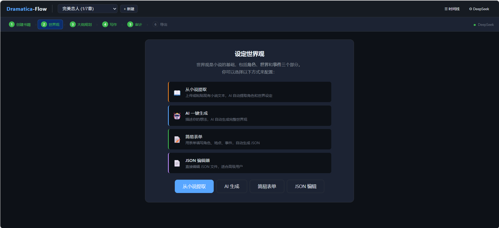
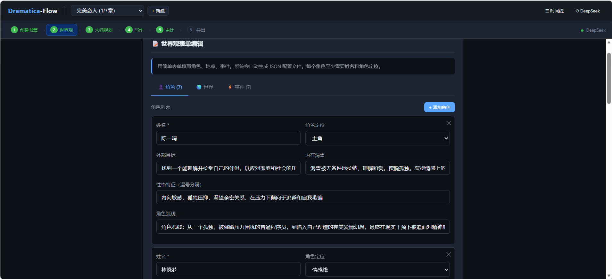
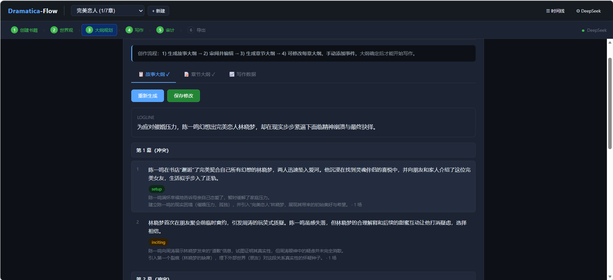
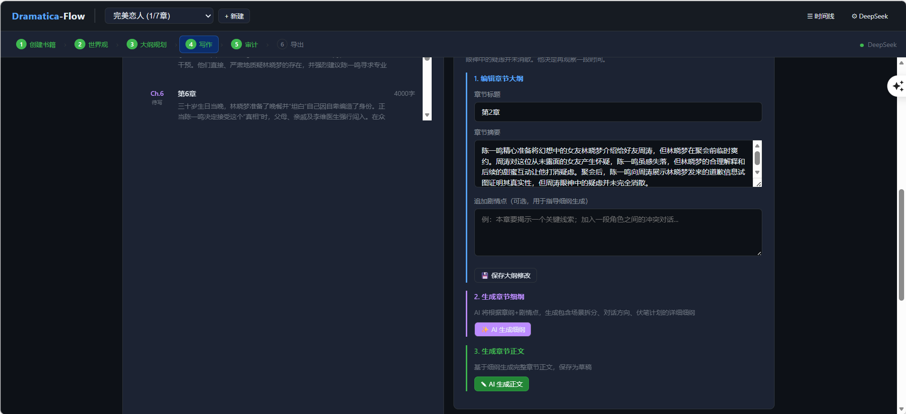
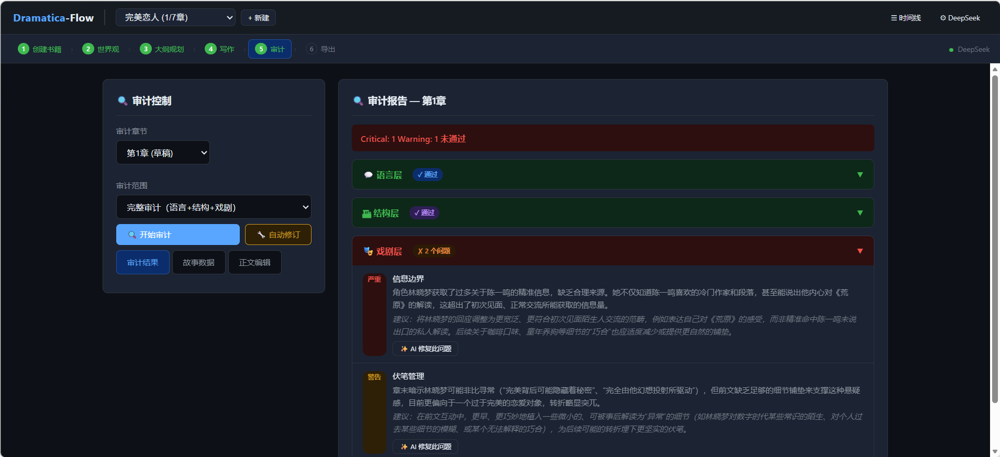
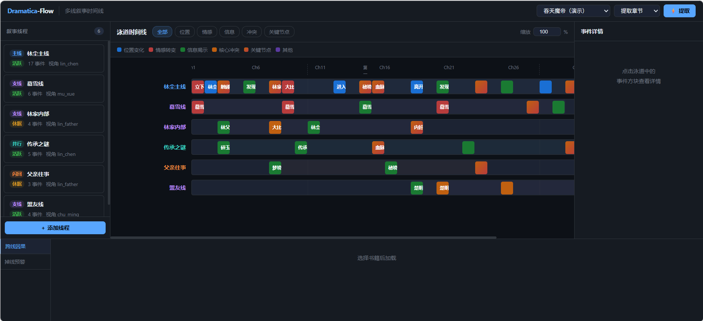

<div align="center">

# Dramatica-Flow

### 叙事智能驱动的 AI 长篇小说创作系统

**让 AI 理解故事，而不是只会写文字。**

[](https://www.python.org/downloads/)
[](https://fastapi.tiangolo.com/)
[](LICENSE)

[快速开始](#快速开始) · [核心能力](#核心能力) · [架构设计](#架构设计) · [功能演示](#功能演示) · [API 文档](#api-接口)

---

<p align="center">
  
  &nbsp;
  
  &nbsp;
  
  &nbsp;
  
</p>

</div>

<p align="center">
  
</p>
<p align="center"><i>世界观构建 — 可视化配置角色、势力、地点与世界规则</i></p>

---

## Dramatica-Flow 是什么？

Dramatica-Flow 是一款面向网文作者和专业写作者的 **AI 辅助长篇小说创作平台**。它不是简单的"AI 写字机器"，而是基于 **Dramatica 叙事理论**构建的智能创作系统——

系统将小说创作抽象为可量化、可追踪、可审计的工程流程，通过 **因果链管理、情感弧线追踪、伏笔系统、关系网络**等核心机制，确保 AI 生成的内容具有真正的叙事逻辑和内在一致性，而非松散的事件堆砌。

### 与普通 AI 写作工具的核心差异

| | 普通 AI 写作工具 | **Dramatica-Flow** |
|---|---|---|
| 叙事逻辑 | 逐段生成，缺乏全局因果 | **强制建模因果链**：每个事件必须回答"因为什么→发生了什么→导致了什么" |
| 角色一致性 | 容易 OOC（性格崩塌） | **信息边界系统**：角色只知道亲眼所见/亲耳所闻，杜绝信息越界 |
| 长篇连贯性 | 前后矛盾频发 | **世界状态快照 + 真相文件**：章节间状态累积，永不丢失 |
| 伏笔管理 | 无 | **伏笔生命周期**：埋设 → 追踪 → 预警 → 回收，超期自动提醒 |
| 质量控制 | 无审计 | **三层审计机制**：规则验证 → 叙事审计 → 修订闭环 |
| 多线叙事 | 无 | **全局时间轴**：多线程调度、跨线程感知、支线掉线预警 |

---

## 核心能力

### 1. 因果链引擎 — 故事的骨架

每个事件都遵循严格的因果结构：

```
Ch.1: 慕雪当众退婚
├── 因（Cause）     ：慕家认为废灵根林尘无法带来家族利益
├── 事（Event）     ：林尘蒙受公开羞辱
├── 果（Effect）    ：林尘立下三年之约
└── 决（Decision）  ：林尘 → 独闯青峰山，拼死修炼
```

AI 写作时强制注入因果链上下文，确保每一章都是前因的自然延续，而非随意拼接的独立场景。

### 2. 智能伏笔系统 — 不被遗忘的承诺

自动管理四种叙事承诺：

| 类型 | 说明 | 示例 |
|------|------|------|
| **伏笔** (Foreshadow) | 暗线铺垫 | 第3章提及的神秘玉佩，第28章揭示身世 |
| **承诺** (Promise) | 对读者的承诺 | "三年之约"必须在三年内兑现 |
| **悬念** (Mystery) | 未解之谜 | 密室中消失的灵力到底去了哪里 |
| **冲突** (Conflict) | 未解决矛盾 | 两大势力的暗战何时爆发 |

系统自动追踪伏笔状态，超期未回收时发出预警，杜绝"挖坑不填"。

### 3. 情感弧线 — 可视化的角色成长

为每个角色建立 1-10 级的情感强度追踪：

```
林尘：屈辱(9) → 愤怒(8) → 震惊(7) → 坚定(7) → 自信(6) → 恐惧(9) → 坚定(10)
                                                                    ↑
                                                               角色弧线完成
```

支持 Dramatica 双层需求模型：**外部目标**（可见的、可量化的）与 **内在渴望**（角色自己不自知的）。

### 4. 角色关系网络 — 动态演变的人际图谱

关系强度从 **-100（死敌）到 +100（生死同盟）** 连续变化，每次事件后自动更新：

```python
# 关系变化示例
"林尘-慕雪：+20，慕雪看到林尘为救她不惜受伤"
"林尘-萧天：-30，萧天暗中勾结魔族被揭穿"
```

### 5. 多线叙事 — 全局时间轴调度

支持 **主线、支线、并行线、闪回线** 四种叙事线程，每种线程拥有独立的：
- 视角角色与角色群
- 目标弧线与成长轨迹
- 篇幅权重（自动调整字数分配）
- 掉线预警（超过 5 章未活跃自动提醒）

全局时间轴记录"谁在什么时候，在什么地方，做了什么"，是多线叙事的"上帝视角"账本。

### 6. 信息边界 — 杜绝全知视角污染

每个角色维护独立的信息记录：

```python
@dataclass
class KnownInfoRecord:
    character_id: str      # 谁知道的
    info_key: str          # 什么信息
    content: str           # 具体内容
    learned_in_chapter: int  # 在哪一章知道的
    source: Literal["witnessed", "hearsay", "deduced", "document"]  # 信息来源
```

**角色不能知道他没见过的事** —— 这是 Dramatica-Flow 与其他 AI 写作工具最本质的区别之一。

---

## 架构设计

### 五层 Agent 写作管线

```
快照备份
    ↓
① 建筑师 Agent ── 规划蓝图（因果链上下文 + 前情摘要 + 伏笔状态）
    ↓
② 写手 Agent ── 生成正文 + 写后结算表
    ↓
③ 写后验证器 ── 零 LLM 硬规则检测（字数、禁忌词、格式）
    ↓ error → spot-fix
④ 审计员 Agent ── 叙事质量审计（temperature=0，确保客观）
    ↓ critical → 修订者 Agent → 再审（最多 2 轮闭环）
⑤ 因果链提取 ── 从正文中提取因果关系 → 写入世界状态
    ↓
摘要生成 ── 章节摘要注入真相文件
    ↓
状态结算 ── 位置/情感/关系/伏笔 → world_state.json
```

### Dramatica 理论集成

系统内置完整的 **Dramatica 角色职能体系**：

| 职能 | 英文 | 叙事作用 |
|------|------|---------|
| 主角 | Protagonist | 推动故事前进的核心力量 |
| 反派 | Antagonist | 与主角目标对立的对抗者 |
| 冲击者 | Impact Character | 改变主角认知的关键人物 |
| 守护者 | Guardian | 导师/引导者 |
| 阻碍者 | Contagonist | 表面帮助实则拖延 |
| 伙伴 | Sidekick | 忠诚的支持者 |
| 怀疑者 | Skeptic | 质疑与反面声音 |

以及 **11 种戏剧功能节拍**：建立、激励事件、转折点、中点、危机、高潮、揭示、决策、后果、过渡。

### 技术栈

```
┌──────────────────────────────────────────────────┐
│                   Web UI 层                       │
│   现代化 SPA · 7 大功能模块 · 时间线泳道图        │
├──────────────────────────────────────────────────┤
│                 REST API 层                       │
│   FastAPI · 50+ 端点 · Pydantic 数据校验          │
├──────────────────────────────────────────────────┤
│               Agent 管线层                        │
│   建筑师 · 写手 · 审计员 · 修订者 · 摘要生成      │
├──────────────────────────────────────────────────┤
│               叙事引擎层                          │
│   因果链 · 伏笔系统 · 情感弧线 · 关系网络         │
│   多线叙事 · 信息边界 · 世界状态                   │
├──────────────────────────────────────────────────┤
│               LLM 抽象层                          │
│   DeepSeek API · Ollama 本地模型 · OpenAI 兼容    │
└──────────────────────────────────────────────────┘
```

---

## 功能演示

### Web UI — 一站式创作管理台

启动服务后访问 `http://localhost:8766`，获得完整的可视化管理界面：

**7 大功能模块：**

| 模块 | 功能 |
|------|------|
| **总览面板** | 书籍进度、章节统计、伏笔状态一览 |
| **故事配置** | 角色/势力/地点/世界规则的创建与编辑 |
| **大纲管理** | AI 生成故事大纲、按幕筛选、序列规划 |
| **章节创作** | AI 写作、人工修订、审计结果查看 |
| **故事追踪** | 因果链、情感弧线、伏笔、关系网络实时可视化 |
| **时间线** | 多线叙事泳道图、角色活动追踪、缩放浏览 |
| **系统设置** | LLM 后端切换、模型配置 |

### 世界观配置

在 Web UI 中可视化构建故事世界——角色设定（Dramatica 角色职能、双层需求、性格锁定）、势力关系、地点网络、世界规则，为 AI 写作提供完整的世界观上下文。

<p align="center">
  
</p>

### 大纲规划

基于 Dramatica 理论自动生成三幕结构大纲，支持按幕筛选、序列规划、戏剧功能节拍标注。大纲完成后可一键生成逐章章纲，明确每章的叙事任务和情感目标。

<p align="center">
  
</p>

### 大纲续写联动

故事大纲和章节大纲支持**联动续写**：当故事大纲续写了新序列后，章节大纲续写时会自动检测尚未展开的序列，优先基于新序列的叙事目标、关键事件和结尾钩子来规划章节内容，而非盲目自滚动。当所有序列均已覆盖时，自动回退为基于已有章纲尾部的自由续写模式。

### AI 写作

在大纲和章纲的基础上，AI 根据因果链上下文、前情摘要、伏笔状态自动生成章节正文。写作完成后系统自动提取结算表（角色位置/情感变化/关系变化/伏笔开闭），更新世界状态。

<p align="center">
  
</p>

### 审计与修订

每章写作完成后自动触发三层审计：**规则验证**（字数/禁忌词/格式硬规则）→ **叙事审计**（因果一致性/角色 OOC/伏笔遗漏等维度）→ **修订闭环**（critical 问题自动修订，最多 2 轮）。

<p align="center">
  
</p>

### 时间线泳道图

独立的时间线页面（`/timeline`）提供：

- **多线程泳道**：每条叙事线程独立泳道，事件按章节分布
- **章节范围滑块**：拖动滑块聚焦指定章节区间，快速导航长篇
- **迷你总览热力条**：顶部显示全篇事件密度，一键跳转到感兴趣的区域
- **同章事件错开**：同一章节的多个事件自动垂直错开，避免重叠
- **关键节点过滤**：按事件类型（伏笔埋设/回收、情感转折等）筛选高亮
- **角色活动追踪**：显示角色在各章节的位置和行动
- **缩放控制**：自由调整泳道密度，适配不同篇幅
- **幕结构背景**：三幕结构的视觉分区

<p align="center">
  
</p>
<p align="center"><i>多线叙事时间线 — 泳道图展示各线程事件分布、角色活动与关键节点</i></p>

---

## 快速开始

### 环境要求

- **Python** >= 3.11（[下载地址](https://www.python.org/downloads/)，安装时请勾选 "Add Python to PATH"）
- **LLM 后端**（二选一）：DeepSeek API 密钥 或 Ollama 本地环境

### 安装

```bash
# 克隆项目
git clone https://github.com/ydsgangge-ux/dramatica-flow.git
cd dramatica-flow
```

**一键安装（推荐）：**

| 系统 | 操作 |
|------|------|
| Windows | 双击 `install.bat` |
| Linux / macOS | `bash install.sh` |

脚本会自动完成以下所有步骤：
- 检查 Python 版本（低于 3.11 会提示下载）
- 安装全部依赖包（自动补装缺失包）
- 创建 `.env` 配置文件（如不存在）

**手动安装（如脚本失败）：**

```bash
python -m pip install -e .
```

### 配置 AI 后端

安装完成后，用记事本打开项目根目录的 `.env` 文件，**二选一**配置：

**方式一：DeepSeek API（效果最佳，需付费）**

1. 访问 [DeepSeek 开放平台](https://platform.deepseek.com) 注册并获取 API Key
2. 在 `.env` 中将 `sk-xxx` 替换为你的真实 API Key

```env
LLM_PROVIDER=deepseek
DEEPSEEK_API_KEY=你的真实API Key
```

**方式二：Ollama 本地模型（完全免费）**

1. 访问 [ollama.ai](https://ollama.ai) 下载安装 Ollama
2. 在终端运行 `ollama pull qwen2.5` 下载模型
3. 在 `.env` 中修改：

```env
LLM_PROVIDER=ollama
OLLAMA_MODEL=qwen2.5
```

> 详细配置请参考 [Ollama 使用指南](docs/OLLAMA_GUIDE.md)

### 启动

```bash
# Windows：双击 `启动服务器.bat` 或双击 `启动网页界面.bat`（自动打开浏览器）
# Linux/macOS：python -m uvicorn core.server:app --reload --port 8766

# 或手动启动：
python -m uvicorn core.server:app --reload --port 8766
```

然后访问 **http://localhost:8766** 开始使用。

### 导入已有小说

如果你已有完成的小说（如 10 万字），可以通过外部大模型提取世界观后导入：

1. 打开 [提取提示词模板](templates/novel_extract_prompt.md)，复制提示词和 JSON 格式说明
2. 将提示词 + 小说全文发送给外部大模型（如 [DeepSeek 网页版](https://chat.deepseek.com)，免费、支持超长文本）
3. 复制大模型输出的 JSON
4. 在 Web UI 的 **Step 3 世界观配置** 中点击 **"导入 JSON"**，粘贴即可

---

## 创作流程

```
① 创建书籍        df book --title "我的小说" --genre "玄幻" --chapters 100
       ↓
② 初始化配置      在 Web UI 中配置角色、势力、地点、世界规则
       ↓
③ 生成大纲        AI 基于 Dramatica 理论自动生成三幕结构大纲
       ↓
④ 逐章创作        AI 写作 → 规则验证 → 叙事审计 → 修订闭环
       ↓
⑤ 故事追踪        实时监控因果链、情感弧线、伏笔状态
       ↓
⑥ 导出成品        一键导出为 Markdown / 全文审阅
```

---

## CLI 命令参考

| 命令 | 说明 |
|------|------|
| `df init <name>` | 初始化项目 |
| `df book --title "我的小说" --genre "玄幻" --chapters 100` | 创建新书 |
| `df setup init <book>` | 初始化配置模板 |
| `df setup load <book>` | 加载配置 |
| `df write <book>` | AI 写下一章 |
| `df write <book> --count 5` | 连续写 5 章 |
| `df audit <book> <chapter>` | 审计指定章节 |
| `df revise <book> <chapter>` | 修订章节 |
| `df status <book>` | 查看书籍状态 |
| `df export <book>` | 导出全书 |
| `df doctor` | 诊断项目配置 |

---

## API 接口

系统提供 **50+ REST API 端点**，完整覆盖创作流程。

### 书籍管理
```
GET    /api/books                            # 书籍列表
POST   /api/books                            # 创建书籍
GET    /api/books/{id}                       # 书籍详情
DELETE /api/books/{id}                       # 删除书籍
```

### 故事配置
```
GET    /api/books/{id}/setup/status          # 配置状态
POST   /api/books/{id}/setup/init            # 初始化配置模板
GET    /api/books/{id}/setup/{type}          # 获取配置（角色/势力/地点/事件）
PUT    /api/books/{id}/setup/{type}          # 更新配置
POST   /api/books/{id}/setup/load            # 加载配置到世界状态
```

### AI 创作核心
```
POST   /api/books/{id}/ai-generate/outline            # AI 生成故事大纲
POST   /api/books/{id}/ai-continue/outline            # AI 续写故事大纲
POST   /api/books/{id}/ai-generate/chapter-outlines   # AI 生成章节大纲
POST   /api/books/{id}/continue-writing               # 续写章节大纲（联动故事大纲）
POST   /api/books/{id}/ai-generate/detailed-outline   # AI 生成详细章纲
POST   /api/books/{id}/ai-generate/chapter-content    # AI 生成章节内容
POST   /api/books/{id}/ai-rewrite-segment             # AI 重写指定段落
POST   /api/action/write                              # 执行写作管线
POST   /api/action/audit                              # 执行审计
POST   /api/action/revise                             # 执行修订
POST   /api/action/export                             # 导出全书
```

### 故事追踪
```
GET    /api/books/{id}/causal-chain          # 因果链
GET    /api/books/{id}/emotional-arcs        # 情感弧线
GET    /api/books/{id}/hooks                 # 伏笔列表
GET    /api/books/{id}/relationships         # 关系网络
GET    /api/books/{id}/threads               # 叙事线程
GET    /api/books/{id}/timeline              # 全局时间轴
```

### 故事分析
```
POST   /api/books/{id}/extract-from-novel    # 从现有小说提取世界观
POST   /api/books/{id}/extract-story-state   # 提取故事状态（角色/事件/关系）
POST   /api/books/{id}/three-layer-audit     # 三层审计
GET    /api/books/{id}/audit-results         # 审计结果列表
```

### 系统配置
```
GET    /api/settings                         # 获取配置
POST   /api/settings                         # 更新配置
GET    /api/settings/status                  # 配置状态检测
```

---

## 项目结构

```
dramatica-flow/
├── core/                           # 核心引擎
│   ├── agents/                     # AI Agent（建筑师/写手/审计员/修订者/摘要）
│   ├── llm/                        # LLM 抽象层（DeepSeek + Ollama）
│   ├── narrative/                  # 叙事引擎（大纲解析、因果链提取）
│   ├── state/                      # 状态管理（世界状态、真相文件、快照）
│   ├── types/                      # 数据类型定义（角色/事件/因果链/伏笔...）
│   ├── validators/                 # 内容验证器（零 LLM 硬规则）
│   ├── pipeline.py                 # 五层写作管线
│   └── server.py                   # FastAPI 服务（50+ 端点）
├── cli/                            # 命令行工具
│   └── main.py                     # CLI 入口（Typer）
├── books/                          # 书籍数据目录
├── templates/                      # 配置模板 + 提取提示词
├── tests/                          # 测试套件（89 个用例）
├── docs/                           # 文档
│   ├── CHANGELOG.md                # 更新日志
│   ├── OLLAMA_GUIDE.md             # Ollama 配置指南
│   ├── QUICKSTART.md               # 快速上手
│   ├── PROJECT_STATUS.md           # 项目状态
│   └── screenshots/                # 界面截图
├── dramatica_flow_web_ui.html      # Web UI 主界面
├── dramatica_flow_timeline.html    # 时间线泳道图
├── install.bat                     # Windows 一键安装
├── install.sh                      # Linux/macOS 一键安装
├── 启动服务器.bat                   # Windows 启动服务
├── 启动网页界面.bat                  # Windows 启动并打开浏览器
├── .env.example                    # 环境变量模板
├── pyproject.toml                  # 项目配置
└── setup.py                        # 包安装入口
```

---

## 测试

```bash
# 运行全部测试
python run_tests.py

# 或使用 pytest
python -m pytest tests/ -v
```

---

## 相关文档

- [快速上手指南](docs/QUICKSTART.md) — 5 分钟完成第一次创作
- [Ollama 配置指南](docs/OLLAMA_GUIDE.md) — 本地模型详细配置
- [更新日志](docs/CHANGELOG.md) — 版本功能变更
- [项目状态](docs/PROJECT_STATUS.md) — 开发进度与路线图

---

## 技术规格

| 项目 | 规格 |
|------|------|
| 语言 | Python 3.11+ |
| Web 框架 | FastAPI |
| LLM 接口 | OpenAI SDK（兼容协议） |
| 数据校验 | Pydantic v2 |
| CLI 框架 | Typer + Rich |
| 测试框架 | pytest + pytest-asyncio |
| 前端 | 原生 HTML/CSS/JS（零构建依赖） |
| 支持模型 | DeepSeek、Ollama（qwen2.5/llama3.1/mistral 等） |

---

## 许可证

MIT License

---

## 致谢

- [Dramatica Theory](https://dramatica.com/) — 叙事理论体系
- [FastAPI](https://fastapi.tiangolo.com/) — 高性能 Web 框架
- [Ollama](https://ollama.ai/) — 本地大模型运行时
- [OpenAI SDK](https://github.com/openai/openai-python) — LLM 接口标准
